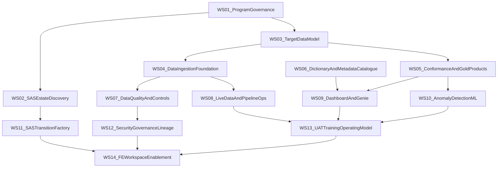

# Dependency Map

## Dependency Narrative
- Governance and SAS discovery drive scope and sequencing for all delivery streams.
- Data model and ingestion foundations must be in place before conformance, quality, and live operations.
- Dashboards, Genie, and anomaly detection depend on stable Gold products and metadata.
- Cutover and FE rollout depend on transition controls, security/governance, and UAT readiness.

## Mermaid Dependency Graph

## Critical Path
1. `WS01 -> WS03 -> WS04 -> WS05 -> WS09 -> WS13 -> WS14`
2. `WS02 -> WS11 -> WS14`
3. `WS04 -> WS07 -> WS12 -> WS14`

## Parallelisable Streams
- `WS06` can run in parallel with late `WS03` and early `WS04`.
- `WS09` and `WS10` can run in parallel once `WS05` and baseline metadata are ready.
- `WS12` can start while `WS11` dual-run is in progress.

## Risk Dependencies to Track
- Source data access and extraction quality from legacy SAS estates.
- Agreement on business definitions for Gold metrics.
- Timely UAT participant availability from Corporate Finance Actuarial.
- Security policy approvals before production rollout.
